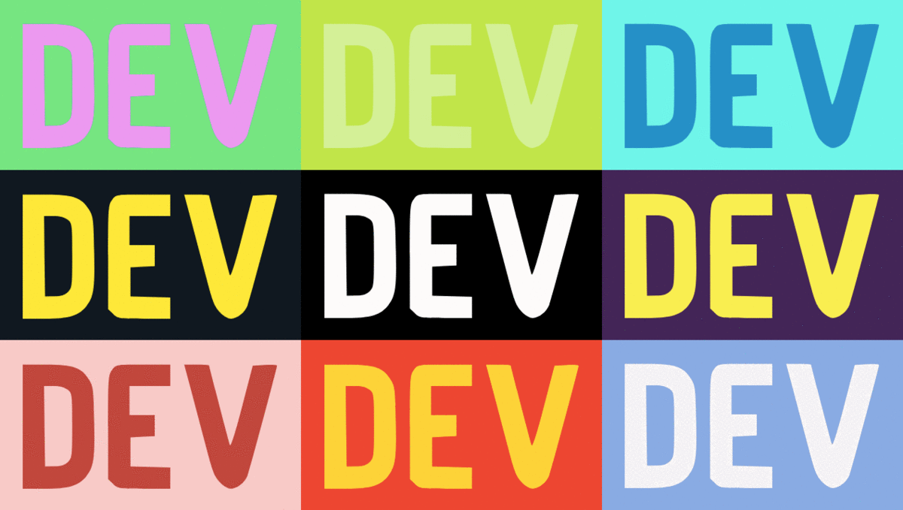

# DEV (unofficial) color picker



> Breeze through available color palettes or enter a DEV username to scrape their profile for their palette! Made with VueJS, Python and BeautifulSoup4.

## Getting started
```bash
# Clone this repository
git clone git@github.com:reiallenramos/dev-badge.git my_app
```

## docker-compose
The project is divided into two docker-compose services. Build both services and start them using:
```bash
docker-compose up
```
Then visit the app via `localhost:8080`

<a href="https://www.buymeacoffee.com/reiallenramos" target="_blank"></a>
